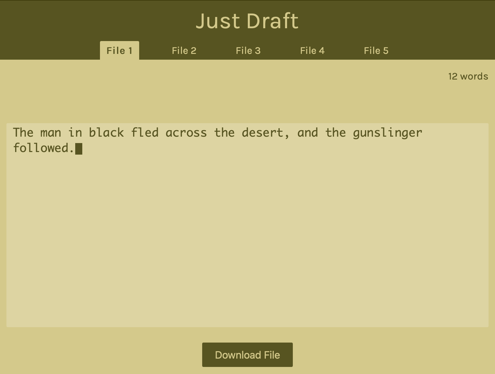

# Welcome to Just Draft

The highly restrictive, minimalist drafting tool you never knew you needed.

You may type whatever you please, but I've removed (mostly) your ability to edit as you go. There is no way to edit your work without manually pressing the delete/backspace key until you reach what you desire to edit. The cursor remains fixed at the end of your text.

This is intentional.

Without the ability to easily go back and edit, you will be free to ignore the critic inside of you and just

Get. Work. Done.

Working on your NaNoWriMo entry? Trying to take your daily word count to the next level?

The only way to push your limits is to put @ss in chair and words on page.

And you can only do that if you get everything you can out of your way. Especially yourself.

This isn't called "Just Draft" for no reason. It's the only thing you're meant to do here. No editing. No going back. Commit to writing and follow your gut.

And then, at the end of the day when you're all done and have satisfied whichever word-count goals you have for yourself, then by all means, download your work, import it into Scrivener (or the editor of your choice), and edit 'til your heart's content.

But not up in here. You take that sh\*t somewhere else.

Here, you're only allowed to do one thing. So shut up and

[Just Draft](donaldhyde.com/just-draft)

<!-- ## About Just Draft

(Speaking of draft...) Inspired by the device FreeWrite and their web editor. I wanted to recreate it. That's how the project started.
Then, as I daydreamed about owning that pricey device, I came across a much older (and out of production) series
of devices from AlphaSmart. These devices are simply word processors whose function seems to have been mainly to
teach school-aged kids how to type. It had a small and simple dot matrix LCD (which I'm considering emulating in
the future), and a keyboard. It had other features, too, but those are what interested me. It was an unconnected
writing tool, something I felt I could use to inspire my own journey as a writer. I ultimately decided to create
this software based around the AlphaSmart devices, especially their simple file management. There are eight
files, each capable of holding around 25 pages of text (it's memory restricted), so I decided to take the
easiest route to start and leverage local storage to hold the text. This removes my need to develop a back-end
system, with the tradeoff being that my software really can't protect your work.

## Things I'm working on:

Turn the nav items into a list

Deliberate the implementation of user input

- Key events, hidden textfield or input, or something else?
- Data management in the app: is there a better way (or many)?

Clean up the code a bit more

Return character (and deleting it)

Should I implement a less restrictive editing expeience that allows editing?

Colors (an update or theme options)

User preferences to store in the local storage

Word count goals, words per minute (and goals)

Maybe some place to put notes? Like a side bar for your outline?

Hide nav while typing

Download all files -->
